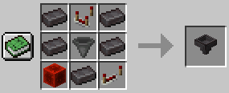
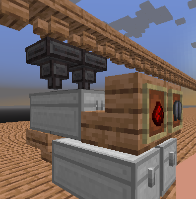

# Ninja Hoppers

Adds an advanced late game filterable hopper designed for sorting/storage systems to Minecraft. Based heavily on [Golden Hoppers](https://github.com/haykam821/Golden-Hoppers). More hoppers to come soon.

Ninja Hoppers requires the [Fabric modloader](https://fabricmc.net/use/) and [Fabric API](https://www.curseforge.com/minecraft/mc-mods/fabric-api).

## Installation

1. Install [Fabric API](https://www.curseforge.com/minecraft/mc-mods/fabric-api) if it is not installed.
2. Download Netherite Hoppers from [GitHub](https://github.com/haykam821/Golden-Hoppers/releases).
3. Place the downloaded file in your `mods` folder.

## Warning

This is currently incompatible with [Hopper Optimizations](https://github.com/2No2Name/hopperOptimizations). I will endeavour to rectify as soon as possible. If you wish to use this mod, you will need to disable hopperOptimizations in the mean time.

## Netherite Hopper

In this initial release of Ninja Hoppers, Netherite hoppers are the only thing added.

### Crafting

When this mod is installed, a new crafting recipe becomes available: 

The recipe is intentionally expensive. It partly mirrors the cost of a normal redstone sorter and also makes it expensive enough that its a considered option and not over powered.

### Usage

The Netherite Hopper has 9 filter slots at the top and one inventory slot below this:

When the filter slots are empty, Netherite Hoppers behave like a normal hopper (with a limited inventory).

Once any slot has an item then the hopper will **ONLY** accept items into its inventory that match one of the filter items. 

### Sorting/Storage Systems

Netherite Hoppers are primarily designed for storage systems. The 9 filter slots allow you to have "grouped" storage, for instance, 9 different colours of will within one chest or maybe every block type of a certain wood. The netherite hopper replaces all of the redstone associated with storage systems. All you need to do is have a way of flowing items over the top of it (I personally use [Wooden Hoppers](https://github.com/haykam821/Wooden-Hoppers)) and then some form of storage below the Netherite Hopper:

 